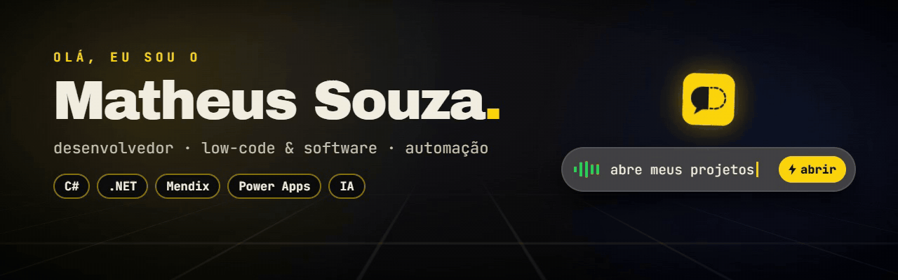

  

  

  

  Crio apps e automações que tiram trabalho repetitivo do caminho: 
  apps <b>low-code</b> com Mendix e Power Apps, ferramentas em <b>C#/.NET</b> e vídeos em <b>motion design feitos com código</b>.

  🎙️ Agora: <a href="https://github.com/theuslpszbr15/QuickVoice"><b>QuickVoice</b></a>, controle o Windows pela voz antes de terminar a frase 
  ⚙️ Apps corporativos com Mendix, Power Apps e SharePoint 
  🎬 Motion design com HTML e GSAP (HyperFrames) 
  🌱 Estudando IA aplicada, .NET e React

  

  

  
  
  
  
  
  

  

  
   
  <b>QuickVoice</b> · C# · .NET 10 · WPF · Whisper offline · <a href="https://github.com/theuslpszbr15/QuickVoice/releases/latest">baixar</a>

  
  

<h3 align="center">
  🔗 <b>Vamos conversar:</b>
    
  
</h3>

  

